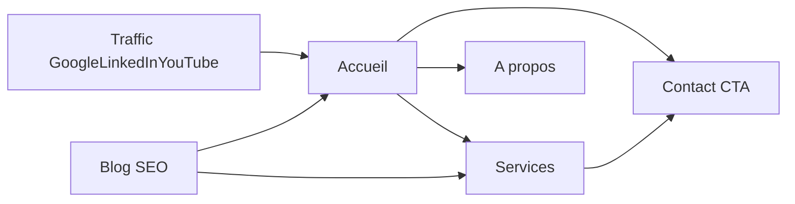

# Plan de création du site Astro (Tailwind + Vue)

## Portée validée

- Emplacement: `D:/www/sites/coachtechno/project`
- Pages V1: Accueil, Services, Coaching technologique, Blog, À propos, Contact
- Source contenu: [D:/www/sites/coachtechno/project/docs/site_corpo/architecture.md](D:/www/sites/coachtechno/project/docs/site_corpo/architecture.md)

## Structure technique

- Initialiser Astro avec intégrations Vue et Tailwind (routing fichier, build statique).
- Organiser le code dans:
  - [D:/www/sites/coachtechno/project/src/layouts/MainLayout.astro](D:/www/sites/coachtechno/project/src/layouts/MainLayout.astro)
  - [D:/www/sites/coachtechno/project/src/components/](D:/www/sites/coachtechno/project/src/components/)
  - [D:/www/sites/coachtechno/project/src/components/vue/](D:/www/sites/coachtechno/project/src/components/vue/)
  - [D:/www/sites/coachtechno/project/src/pages/](D:/www/sites/coachtechno/project/src/pages/)

## Implémentation contenu

- Créer la page d’accueil avec sections de conversion issues du document: proposition de valeur, problèmes, services, cas concrets, crédibilité, CTA.
- Créer les pages coeur:
  - [D:/www/sites/coachtechno/project/src/pages/services.astro](D:/www/sites/coachtechno/project/src/pages/services.astro)
  - [D:/www/sites/coachtechno/project/src/pages/coaching-technologique.astro](D:/www/sites/coachtechno/project/src/pages/coaching-technologique.astro)
  - [D:/www/sites/coachtechno/project/src/pages/blog/index.astro](D:/www/sites/coachtechno/project/src/pages/blog/index.astro)
  - [D:/www/sites/coachtechno/project/src/pages/a-propos.astro](D:/www/sites/coachtechno/project/src/pages/a-propos.astro)
  - [D:/www/sites/coachtechno/project/src/pages/contact.astro](D:/www/sites/coachtechno/project/src/pages/contact.astro)
- Préparer le blog avec quelques articles de départ basés sur les sujets recommandés dans l’architecture (collection de contenu Astro).

## Vue.js (valeur ajoutée)

- Ajouter des composants Vue ciblés (pas toute l’UI):
  - formulaire de contact interactif (validation front)
  - FAQ/accordéon services
  - bloc CTA dynamique réutilisable
- Monter ces composants dans les pages Astro avec hydratation client minimale.

## Design et SEO de base

- Définir un design system Tailwind léger (typographie, couleurs, boutons CTA, sections).
- Ajouter métadonnées SEO par page (title, description, OpenGraph de base).
- Mettre en place navigation/header/footer cohérents sur toutes les pages.

## Vérification

- Lancer build Astro et corriger erreurs éventuelles.
- Vérifier rapidement le rendu desktop/mobile et les liens internes.
- Confirmer que chaque page répond aux 3 questions business du document (pertinence, crédibilité, prise de rendez-vous).

